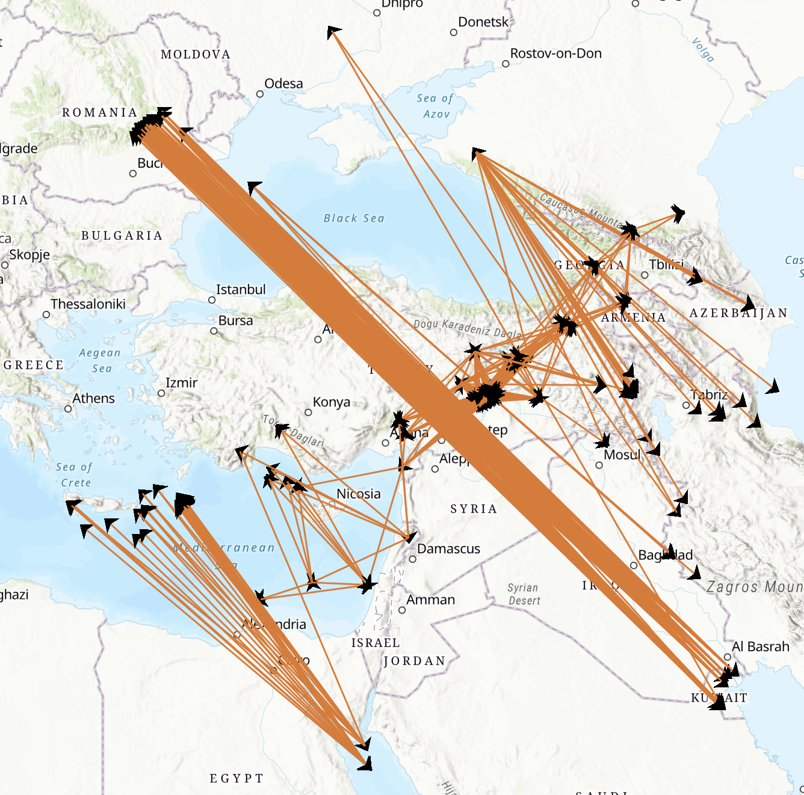

# EarthquakeGraph
Visualize earthquakes on map in the form of a graph 
First specify a starting point. From there, the algorithm finds the greatest magnitude earthquake in a radius R. Then it tries to find adjacent earthquakes that are: 
*In the R radius from the previous earthquake (the parent) 
*Happened after the parent earthquake 
*Returned in the order of magnitude 

Size of graph can be specified, Arcgis map supports a maximum of about 800 points. 

Picture generated with params:  
*START_POINT: counties.ROMANIA,
*STARTTIME: 1.11.1800,
*RADIUS: 400,
*MAX_GRAPH_SIZE: 200,
*ALGO: algoEnum.DEPTH_FIRST,

run with
`npm start`
 

Edit the desired starting point, start date and other params(radius, graph size, algorithm) in src/config/parameterConfig.ts 
If not already there, add the coordinates of the desired starting point in src/config/regionCoordinates.ts 

### To debug with VSCode
run
`tsc`
to generate the js files in the 'built' folder 
then go to 'built/index.js' file and press F5 
select Node.js from the dropdown 
