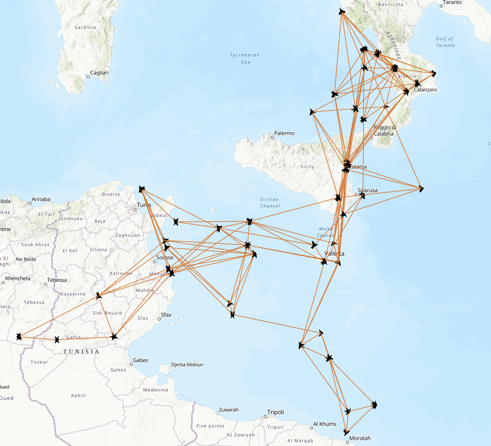

# EarthquakeGraph
Visualize earthquakes on map in the form of a graph 
First specify a starting point. From there, the algorithm finds the greatest magnitude earthquake in a radius R. Then it tries to find adjacent earthquakes that are: 
* In the R radius from the previous earthquake (the parent)
* Happened after the parent earthquake
* Returned in the order of magnitude

Size of graph can be specified, Arcgis map supports a maximum of about 800 points. 

### Sample Visualizations

Picture generated with params:  
* START_POINT: regions.MEDITERANEAN_SEA,
* STARTTIME: 1.11.1800,
* RADIUS: 500,
* MAX_GRAPH_SIZE: 80,
* MAX_NR_OF_CHILDREN: 5,
* ALGO: algoEnum.BREADTH_FIRST,

Meaning for each parent earthquake, it took the top 5 magnitude subsequent earthquakes from a radius of 500km 

Same config as before, except RADIUS = 200   

Picture generated with params:  
* START_POINT: regions.ROMANIA,
* STARTTIME: 1.11.1800,
* RADIUS: 40,
* MAX_GRAPH_SIZE: 100,
* ALGO: algoEnum.BREADTH_FIRST,

Picture generated with params:  
* START_POINT: regions.ROMANIA,
* STARTTIME: 1.11.1800,
* RADIUS: 400,
* MAX_GRAPH_SIZE: 100,
* ALGO: algoEnum.DEPTH_FIRST,

### Usage

run with
`npm start`
 

Edit the desired starting point, start date and other params(radius, graph size, algorithm) in src/config/parameterConfig.ts 
If not already there, add the coordinates of the desired starting point in src/config/regionCoordinates.ts 

### Debugging

for VSCode, 
run
`tsc`
to generate the js files in the 'built' folder 
then go to 'built/index.js' file and press F5 
select Node.js from the dropdown 
